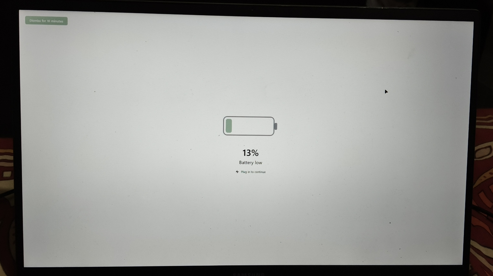
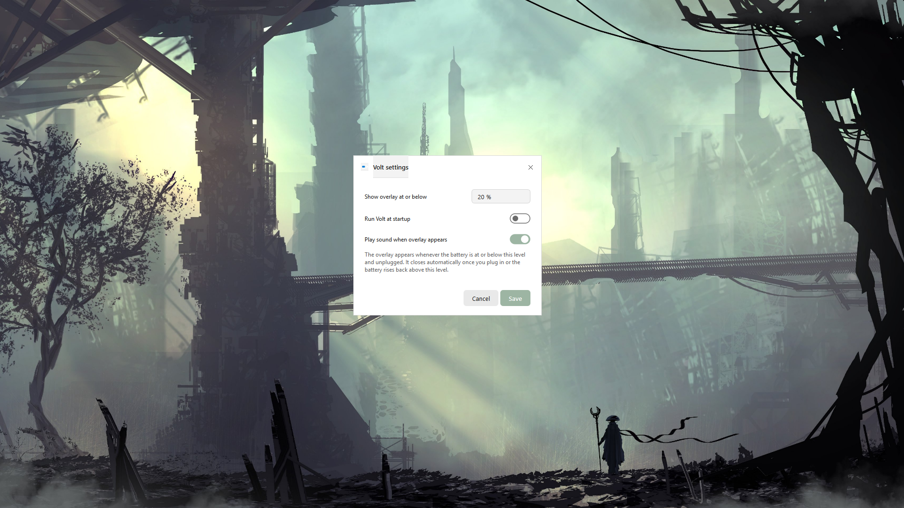
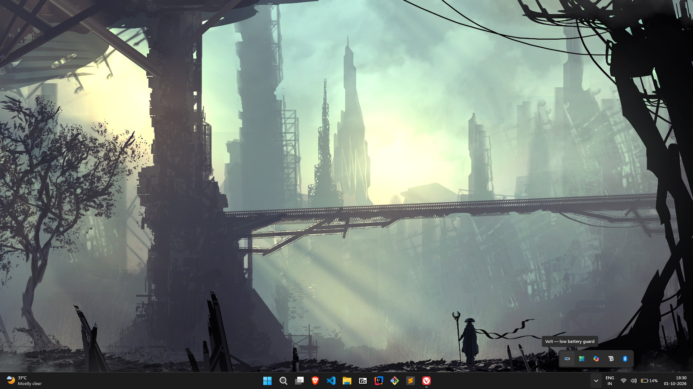
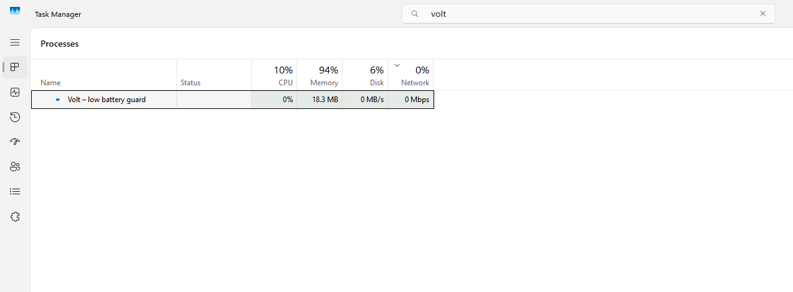

# Volt
Hey this is the official repo for the Volt app which displays a low battery overlay, uses very less app, the values of battery can be changed also according to your preferences and has a very good windows-feel UI
 
## Images
1. Overlay (can be different according to theme mode dark/light and accent color of your system.
   
2. Volt Settings
   
3. Volt in system tray
   
4. Volt resource usage in Task Manager
   
